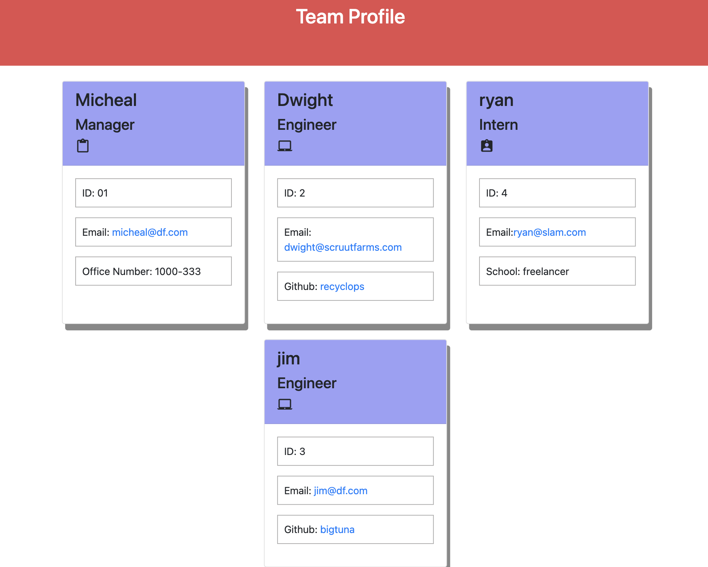

<h1>Team Profile Generator</h1>
  
 <br />
 ## Description
 This application was created to generate a team profile based on user input using the Inquirer module from Node.js and displaying the information on a newly created html page with a style sheet. This project demonstrates use of OOP and TDD using Jest.
 ## Table of Contents
 - [Description](#description)
 - [Installation](#installation)
 - [Usage](#usage)
 - [License](#license)
 - [Contributing](#contributing)
 - [Tests](#tests)
 - [Questions](#questions)
 ## Installation
 This application also requires  fs and inquirer module. If testing is required, this application uses Jest.
 ## Usage
 ```
 AS A manager
I WANT to generate a webpage that displays my team's basic info
SO THAT I have quick access to their emails and GitHub profiles

```

#Acceptance Criteria
```

GIVEN a command-line application that accepts user input
WHEN I am prompted for my team members and their information
THEN an HTML file is generated that displays a nicely formatted team roster based on user input
WHEN I click on an email address in the HTML
THEN my default email program opens and populates the TO field of the email with the address
WHEN I click on the GitHub username
THEN that GitHub profile opens in a new tab
WHEN I start the application
THEN I am prompted to enter the team manager’s name, employee ID, email address, and office number
WHEN I enter the team manager’s name, employee ID, email address, and office number
THEN I am presented with a menu with the option to add an engineer or an intern or to finish building my team
WHEN I select the engineer option
THEN I am prompted to enter the engineer’s name, ID, email, and GitHub username, and I am taken back to the menu
WHEN I select the intern option
THEN I am prompted to enter the intern’s name, ID, email, and school, and I am taken back to the menu
WHEN I decide to finish building my team
THEN I exit the application, and the HTML is generated

```


# MockUp
Video demo of the applicaiton can be found [here](https://www.youtube.com/watch?v=4V7OA8JCM54)


## License


<br />
This application is covered by the MIT license.

## Contributing

sayam gautam

## Tests

npm run test

## Questions

If you have any questions about this projects, please contact me directly through my email<br />
<br />
Find me on GitHub: [sayamgautam1](https://github.com/sayamgautam1)<br />
<br />
✉️ Email me with any questions: sayamgautam1@gmail.com<br /><br />
```
